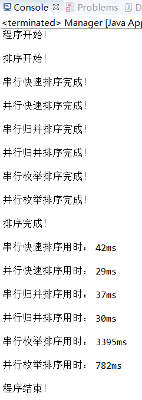

# 《并行处理技术》课程Project：三种排序的串行与并行比较
刘潇远
161220083
liuxy@smail.nju.edu.cn
## 一、算法实现及技术要点
本人电脑处理器为i5-6300HQ，为四核心四线程处理器，最大并行度为4，在具体实现中据此进行实现。
### 1、串行快速排序
快速排序是串行排序算法中时间复杂度最低的，快速排序的实现基于一个**逆序对**的定义，定义如下
*给定一组各不相同的全序的元素。对于这些元素的一个排列a1,a2,...,an而言，称二元组(ai,aj)为一个逆序对，如果i<j，且ai>aj*
根据逆序对的定义，一个偏大的元素应该尽量地往后放，这样它就以更小的可能性与其他元素组成逆序对；对应地，一个偏小的元素应该尽量往前放。根据这一思路，首先需要选取一个基准元素*pivot*，以它为基准来界定一个元素的大小。然后将所有元素与基准元素相比较，如果一个元素比基准元素大，则把它放在基准元素右边，反之放在左边。
当所有元素与基准元素进行比较后，就将所有元素分为左边、基准元素和右边这三部分。此时基准元素已经处在了它正确的位置上。左边的元素虽然内部是乱序的，但是它们必然在基准元素左边的某个位置上；右边的情况类似。此时只需要递归地对左右部分按照上述过程进行划分，则可以完成所有元素的排列。这就是串行快速排序算法的基本原理。快速排序算法是分治策略的典型应用，并且是“难分易合”型的分治算法。算法伪代码如下
```javascript
Partition(A, p, r)
Begin
    pivot := A[r]
    i := p-1;
    for j := p to r-1 do
        if A[j] < pivot then
            i := i+1;
            SWAP(A[i], A[j]);
    SWAP(A[i+1], A[r]);
    return i+1;
End

QUICK-SORT(A, p, r)
Begin
    if p < r then
        q := partition(A, p, r);
        QUICK-SORT(A, p, q-1);
        QUICK-SORT(A, q+1, r);
End
```

### 2、并行快速排序
快速排序算法并行化的一个简单思想是，对每次划分后所得到的两个序列分别使用两个处理器完成递归排序。对于一个长为n的序列，首先划分为两个序列，再将这两个序列划分为四个序列，交由CPU的四个核心处理。算法伪代码如下
```javascript
PARALELL-QUICK-SORT(data, i, j, m, id)
Being
    if j-i<=k or m=0 then
        P_id call QUICK-SORT(data, i, j);
    else
        P_id: r=partition(data, i, j);
        P_id send data[r+1,j] to P_id+2^(m-1)-1
        PARALELL-QUICK-SORT(data, i, r-1, m-1, id)
        PARALELL-QUICK-SORT(data, r+1, j, m-1, id+2^(m-1)-1)
        P_id+2^m-1 send data[r+1,j] back to P_id
End
```
### 3、串行归并排序
归并排序是一种经典的分治算法。与“难分易合型”的快速排序对偶，归并排序是一种“易分难合型”的分治算法。这类分治算法主要基于这样的思路：当没有明显的线索提示如何分割子问题时，就直接对子问题进行均匀分割。对于每个子问题，递归地对它们进行求解。当已经有每个子问题的解时，把它们合并成原始问题的解，往往比直接求解原始问题更加容易。
具体到合并排序的例子，直接将输入序列从中间分割为两个子序列，递归地对两个子序列进行排序。如果两个子序列已经排好序，则把它们合并为一个有序的序列时相对容易的。取它们的最小元素进行比较，这二者之间的最小者一定是全局最小的，则可以把它放在输出数组的首位。对剩下的元素重复继续进行这一过程，可以将两个子序列中的元素合并为一个有序的序列。基于合并两个有序子序列的过程，可以很容易递归地实现=合并排序，伪代码如下所示
```javascript
MERGE(A, p, q, r)
Begin
    n1 := q - p + 1;
    n2 := r - q;
    Let L[1..(n1+1)] and R[1..(n2+1)] be new arrays;
    for i:=1 to n1 do
        L[i] := A[p+i-1];
    for j:=1 to n2 dp
        R[j] := A[q+j];
    L[n1+1] := MAX_INT;
    R[n2+1] := MAX_INT;
    for k:= p to r do
        if L[i]<R[j] then
            A[k] := L[i];
            i := i + 1;
        else
            A[k] := R[j];
            j := j + 1;
End

MERGE-SORT(A, p, r)
Being
    if p < r then
    q := (p+q)/2;//向下取整
    MERGE-SORT(A, p, q);
    MERGE-SORT(A, q+1, r);
    MERGE(A, p, q, r);
End

```
### 4、并行归并排序
并行归并排序基于串行归并排序改进：按照均匀划分技术的划分方法，将输入数组分割成四段大致相同地子数组，并行地对其进行排序，之后再并行地进行合并，伪代码如下
```javascript
Begin
    1.均匀划分：将n个元素A[1..n]均匀划分成4段，每个CPU核心A[(i-1)n/4+1..in/4]//i=1~4
    2.局部排序：四个处理器核心分别对其分到的数据进行串行排序
    3.选取样本：pi从其有序子序列A[(i-1)n/4+1..in/4]中选取4个样本元素
    4.样本排序：用一台处理器对16个样本元素进行串行排序
    5.选择主元：用一台处理器从排好序的样本序列中选取3个主元，并播送给其他pi
    6.主元划分：pi按主元将有序段A[(i-1)n/4+1..in/4]划分成p段
    7.全局交换：各处理器将其有序段按段号交换到对应的处理器中
    8.归并排序：各处理器对接收到的元素进行归并排序 
End
```
### 5、串行枚举排序
枚举排序的思想是对于数组中的每个数据，遍历数组记录小于该数据的数据数量，称为秩，秩便为该数据在有序数组中的位置。在实际操作时，秩除了是小于该数据的数据量，还要加上等于该数据且在原始数组中位置在该数据前的数据。算法伪代码如下：
```javascript
ENUM-SORT(A, p, r)
Begin
    Let B[p..r] be new arrays;
    for i:=p to r do
        B[i] := A[i];
    for i:=p to r do
        int rank = 0;
        for j:=0 to r-p+1 do
            if A[i]>A[j] or (A[i]=A[j] and i>j)
                rank++;
        B[rank] = A[i];
    for i:=p to r do
        A[i] := B[i];
End
```
### 6、并行枚举排序
并行枚举排序基于串行枚举排序改进而来,假设对一个长为n的输入序列使用n个处理器进行排序，只需使每个处理器负责完成对其中一个元素的定位，然后将所有的定位信息集中到主进程钟，由主进程负责完成所有元素的最终排位。只需建立一个固定线程数为4的线程池，由于枚举排序并不在原数组中进行排序，而元素在新数组中的位置唯一，因此无需考虑同步、死锁问题，只需不断向线程池中加入线程，线程中对数组中某个元素进行寻秩操作并赋值到新数组中，线程全部执行完后输出数组即可。伪代码略
## 二、运行结果
||快速排序|归并排序|枚举排序|
|:----:| :----:|:----:|:----:|
| 串行算法用时(ms) |42| 37 |3395|
|并行算法用时(ms)|29|30|782|
注：上述运行时间除了排序时间外，还包含了将排序结果写到文件中的时间
运行结果截图如下


## 三、心得体会
在编程过程中，我主要遇到了两个问题。
第一个是代码复用问题，刚开始我先完成了三个排序的串行算法，之后再并行算法实现时，直接在串行算法中实现了Runnable接口，在run()方法中调用串行的实现，由于串行算法中包含了写文件操作，导致我在完成并行算法后串行算法写出的文件有问题，我还以为是我写错了。
另一个时，尽管并行算法能够加快排序，但是如果不等所有线程都完成排序便开始向文件中写入结果，会出错，我debug的大部分时间都花费在这里。解决办法是使用CountDownLatch类，初始化参数为线程数，每个线程的run()方法最后都会执行CountDownLatch类的countDown()方法，在主进程（以并行归并排序为例）中使用如下结构进行等待,其中mergeSignal为主进程中定义的CountDownLatch类
```javascript
//并行归并算法的一段实现
try {
    mergeSignal.await();
} catch (InterruptedException e) {
    e.printStackTrace();
}
```
在countDown()执行次数达到实例化该类时传入参数的次数时，主进程就不再等待，这就表示所有排序都已完成，可以进行文件写操作了。